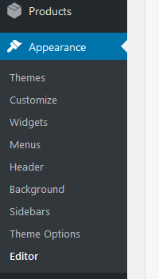
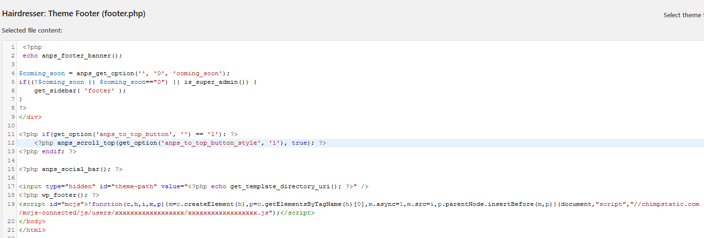
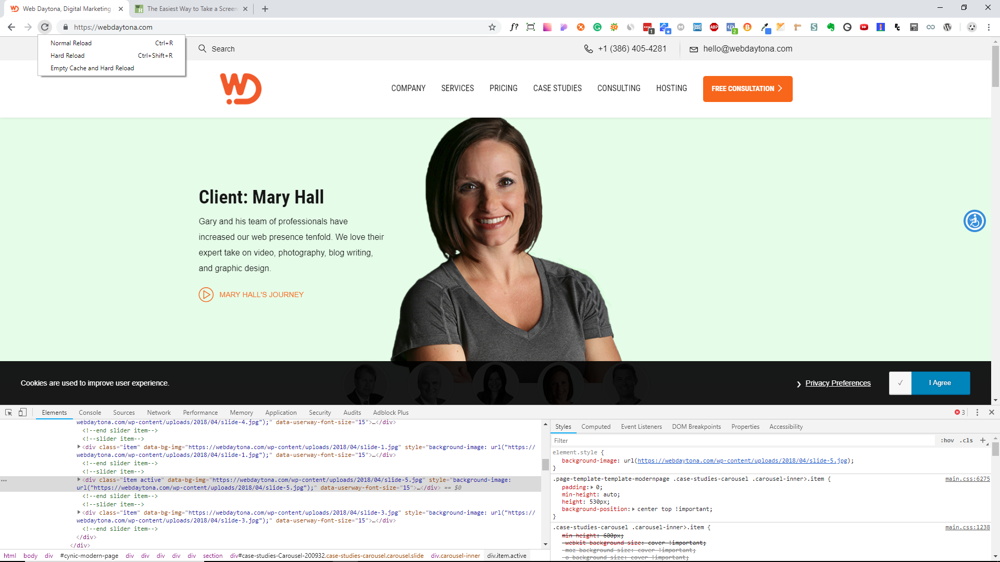

# Mailchimp pop-up form not working:solved

## MailChimp javascript code is that the  Pop-Up doesn't work on WordPress websites. 

<h5>PROBLEM:</h5>
<p><strong>MailChimp</strong> is one of the best solutions to get users to subscribe to any newsletter or collect their email addresses. One of the common problems that we encounter regularly at Web Daytona with <strong>MailChimp javascript code</strong> is that the <strong> Pop-Up doesn't work</strong> on WordPress websites</p>
<br>

We added the **MailChimp Subscriber Pop-Up** embed code to our clients  **WordPress** websites,but nothing would happen after the website loaded in. After countless hours of research on  Google, I’ve noticed that many others are experiencing the same problem in WordPress.
<br>
## Console Error
```javascript
Loading failed for the 
<script> with source 
https://downloads.mailchimp.com/js/signup-forms/popup/unique-methods/embed.js
```
<br>
The problems is that when we put the mailchimp pop-up code for wordpress in the header.php file, the Mailchimp script depends on jquery and the mailchimp script is then fetched first from the server and  jquery after. This ultimately left the mailchimp script in a dead end without the dependency that it needs.
<br>

#### Example of mailchimp  code for the pop-up doesn't work :
```javascript 
  <script id="mcjs">
   !function(c,h,i,m,p)
   {m=c.createElement(h),
   p=c.getElementsByTagName(h)[0],
   m.async=1,m.src=i,
   p.parentNode.insertBefore(m,p)}
   (document,"script",
   "//chimpstatic.com/mcjs-connected/js/users/xxxxxxxxxxxxxxxxxx/xxxxxxxxxxxxxxxxxx.js");
   </script>

```
#### Here is the solution that we found:


1. Go Appearance > editor > footer.php



2. Paste the Mailchimp script code before the body closing tag, save, and go to your website.


3. Clear the cache and Hard Reload your website If your in Google Chrome. Open the inspector and right click the” reload/refresh”, then click “empty cache and hard reload”.


<br>

#### You’ve just learned the steps needed to take care of your Mailchimp pop-up not working. 

<br>